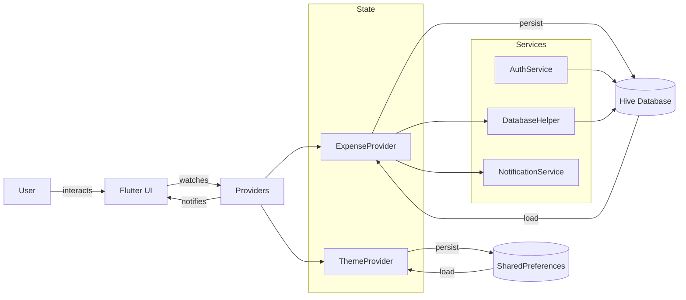

# Smart Expense Tracker

A comprehensive, multi-platform Flutter app that helps students and individuals track expenses, manage budgets, set savings goals, and gain financial insights with beautiful UI, rich animations, and intelligent analytics.

> Smart. Intuitive. Insightful. Built with Provider, Hive, and a premium design system.

<p align="center">
    <a href="https://flutter.dev" target="_blank">
        
    </a>
    <a href="https://dart.dev" target="_blank">
        
    </a>
    <a href="https://pub.dev/packages/provider" target="_blank">
        
    </a>
    <a href="https://pub.dev/packages/hive" target="_blank">
        
    </a>
    <a href="https://pub.dev/packages/fl_chart" target="_blank">
        
    </a>
    <a href="https://firebase.google.com/" target="_blank">
        
    </a>
    <a href="https://m3.material.io/" target="_blank">
        
    </a>
</p>

---

## 🚀 Highlights

- **Multi-Platform**: Android, iOS, Web, macOS, Windows & Linux (Flutter).
- **User Authentication**: Secure signup/login with user data isolation using Hive storage.
- **Expense Management**: Create, edit, delete, categorize, and track expenses with visual insights.
- **Budget Tracking**: Set category-specific budgets with real-time spending alerts and progress monitoring.
- **Savings Goals**: Create and track savings goals with progress visualization and achievement milestones.
- **Smart Analytics**: Interactive charts, spending trends, category breakdowns, and financial insights.
- **Category System**: 8 predefined categories (Food, Transportation, Shopping, etc.) with distinct colors & icons.
- **Notifications**: Smart reminders for budget limits, savings goals, and expense tracking habits.
- **Glassmorphic UI**: Modern design with glassmorphism effects, gradient headers, and smooth animations.
- **Light / Dark Themes**: Fully themed with a premium design system supporting both modes.
- **Persistent Storage**: Offline-first architecture with Hive database for lightning-fast performance.
- **User Isolation**: Complete data separation between users with secure authentication.
- **Responsive Design**: Adaptive layouts optimized for different screen sizes and orientations.

---

## 📹 Demo Video

<div align="center">

<a href="https://www.youtube.com/watch?v=MluEDQ58BUw">

</a>

</div>

---

## 📱 Download APK

Experience Smart Expense Tracker instantly on your Android device.

<p align="center">
  <a href="https://github.com/ShaniaKamikazi/Flutter_Smart_Expense_Tracker/releases/download/v1.0.0/Smart_Expense_Tracker.apk" target="_blank">
    
  </a>
</p>

<p align="center">
  <a href="https://github.com/your-org/smart-expense-tracker/releases/latest/download/smart-expense-tracker.apk" target="_blank">
    
  </a>
  
  
</p>

> **Note:** Enable "Install from unknown sources" in your Android settings to install the APK. The app requires Android 5.0 (API level 21) or higher.

---

## 🧩 Architecture Overview

The app follows a layered, provider-driven architecture emphasizing clean separation of concerns and reactive UI updates.

| Layer | Responsibility | Implementation |
|-------|----------------|----------------|
| Models | Immutable domain entities with Hive adapters | `Expense`, `Budget`, `SavingsGoal`, `User` |
| State | Business logic & UI state management | Provider `ChangeNotifier` (`ExpenseProvider`, `ThemeProvider`) |
| Persistence | Local database & authentication | Hive boxes with type adapters & AuthService |
| Presentation | Screens, widgets, theming | `screens/*`, `widgets/*`, `config/app_theme.dart` |
| Services | External integrations & utilities | `AuthService`, `DatabaseHelper`, `NotificationService` |

### Data Flow
1. UI widgets consume state via `Consumer<Provider>` or `context.watch<Provider>()`.
2. User actions trigger provider methods (`addExpense`, `updateBudget`, `createSavingsGoal`, etc.).
3. Providers update in-memory state and persist changes to Hive databases.
4. UI automatically rebuilds when providers notify listeners.

### State Management: Why Provider?
- Simple, battle-tested state management with excellent performance.
- Built-in dependency injection and widget rebuilding optimization.
- Clear separation between business logic and UI concerns.

### Database: Why Hive?
- Lightning-fast NoSQL database written in pure Dart.
- Type-safe object storage with code generation.
- Offline-first architecture with automatic persistence.
- Zero native dependencies for cross-platform compatibility.

### Navigation
- Root: `MyApp` determines authentication state (Landing vs Home).
- Main Navigation: Tab-based navigation between Expenses, Budget, Savings, and Reports.

---

## 🛠 Tech Stack

| Category | Tools |
|----------|-------|
| Framework | Flutter (Material 3) |
| State Management | Provider (`provider`) |
| Database | Hive (`hive`, `hive_flutter`) with code generation |
| Authentication | Custom AuthService with Hive storage |
| Charts | FL Chart (`fl_chart`) |
| Notifications | Flutter Local Notifications |
| Date/Number Formatting | `intl` |
| Theme Persistence | SharedPreferences |
| Cloud Services | Firebase (Auth, Firestore) |
| Build Tools | `build_runner`, `hive_generator` |

---

## 📂 Folder Structure

```
.
├── analysis_options.yaml
├── pubspec.yaml
├── lib/
│   ├── main.dart
│   ├── config/
│   │   └── app_theme.dart
│   ├── models/
│   │   ├── budget.dart
│   │   ├── expense.dart
│   │   ├── savings_goal.dart
│   │   └── user.dart
│   ├── providers/
│   │   ├── expense_provider.dart
│   │   └── theme_provider.dart
│   ├── screens/
│   │   ├── add_expense_screen.dart
│   │   ├── add_savings_goal_screen.dart
│   │   ├── budget_screen.dart
│   │   ├── enhanced_landing_screen.dart
│   │   ├── home_screen.dart
│   │   ├── profile_screen.dart
│   │   ├── reports_screen.dart
│   │   ├── savings_screen.dart
│   │   └── signup_screen.dart
│   ├── services/
│   │   ├── auth_service.dart
│   │   ├── database_helper.dart
│   │   └── notification_service.dart
│   └── widgets/
│       ├── glassmorphism_card.dart
│       ├── theme_aware_card.dart
│       └── theme_card.dart
└── test/
        └── widget_test.dart
```
Other platform directories (`android/`, `ios/`, `web/`, `macos/`, `windows/`, `linux/`) are auto-generated/managed by Flutter.

### Data Flow Diagram



---

## ✅ Features In Detail

| Area | Details |
|------|---------|
| Authentication | Local signup/login with secure user isolation |
| Expenses | CRUD operations, 8 categories, date tracking, user-specific filtering |
| Budget Management | Category-based budgets, spending alerts, progress tracking, visual indicators |
| Savings Goals | Target setting, progress monitoring, milestone achievements, deadline tracking |
| Analytics | Interactive charts, spending trends, category breakdowns, monthly/yearly reports |
| Notifications | Budget alerts, savings reminders, spending habit notifications |
| UI/UX | Glassmorphic design, gradient headers, smooth animations, responsive layouts |
| Theming | Light/Dark mode, premium color palette, semantic design tokens |
| Data Persistence | Hive database with type adapters, offline-first architecture |

---

## 🔧 Getting Started

### Prerequisites
- Flutter SDK >= 3.0.0
- Dart >= 3.0.0
- A device/emulator or browser for Web

### Setup

```bash
# Clone the repository
git clone https://github.com/your-org/smart-expense-tracker.git
cd smart-expense-tracker

# Install dependencies
flutter pub get

# Generate Hive adapters
flutter pub run build_runner build

# Run on a connected device or emulator
flutter run

# Run tests
flutter test
```

### Platform-Specific
- **Web**: `flutter run -d chrome`
- **Desktop**: Ensure desktop support is enabled (`flutter config --enable-<platform>-desktop`).

---

## 🧪 Testing
- Includes Flutter widget testing framework.
- Recommended test coverage:
    - Provider unit tests (`ExpenseProvider`, `ThemeProvider`).
    - Database operation tests (`DatabaseHelper`).
    - Authentication flow tests (`AuthService`).
    - Widget integration tests for critical user flows.

---

## 🎨 Theming & Design System
Centrally defined in `config/app_theme.dart`:
- **Color Palette**: Primary purple, secondary green, accent pink with success/warning/error variants.
- **Gradients**: Premium gradient combinations for headers and cards.
- **Typography**: Material 3 text styles with custom sizing.
- **Spacing**: Consistent padding, margin, and border radius values.
- **Theme Support**: Comprehensive light/dark mode with proper contrast ratios.

Easily customizable for brand adaptation or dynamic theming requirements.

---

## 🧠 State Management Summary
- **Provider Pattern**: ChangeNotifier-based providers for reactive UI updates.
- **ExpenseProvider**: Manages all financial data (expenses, budgets, savings goals).
- **ThemeProvider**: Handles theme switching with persistence.
- **Separation of Concerns**: Clear distinction between UI state and business logic.

---

## 📦 Persistence Strategy
- **Hive Database**:
    - User accounts and authentication data
    - Per-user expense records with type adapters
    - Budget and savings goal data with relationships
    - Automatic serialization/deserialization
- **SharedPreferences**: Theme preferences and app settings
- **User Isolation**: Complete data separation using userEmail filtering

---

## 👥 Contributing

Contributions are welcome! Suggested workflow:
1. Fork the repo
2. Create a feature branch (`feat/your-feature-name`)
3. Commit with conventional messages (`feat: add expense categories`)
4. Write/update tests where relevant
5. Open a Pull Request with clear description & screenshots

Please consider adding documentation for new providers or architectural changes.

---

## 🙌 Acknowledgements
- Flutter & Dart teams
- Provider package maintainers
- Hive database contributors
- FL Chart visualization library
- Material Design team

---

## 📬 Contact
Add your contact or support channel here:
- Email: kamikazishania@gmail.com


---

Empowering financial wellness through intelligent design, robust architecture, and delightful user experience—thanks for exploring, and happy tracking!


